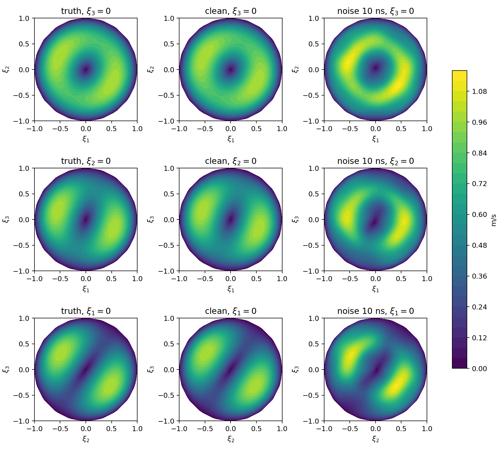
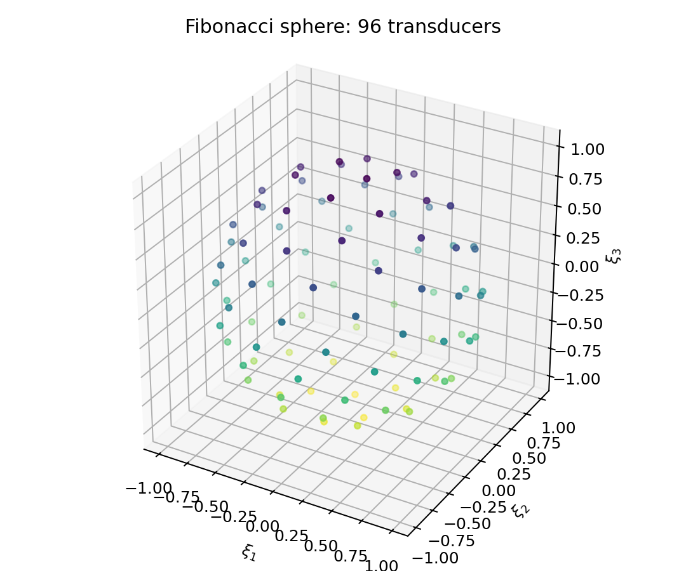
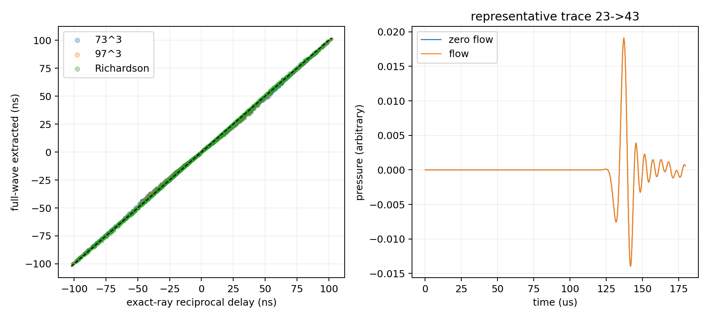
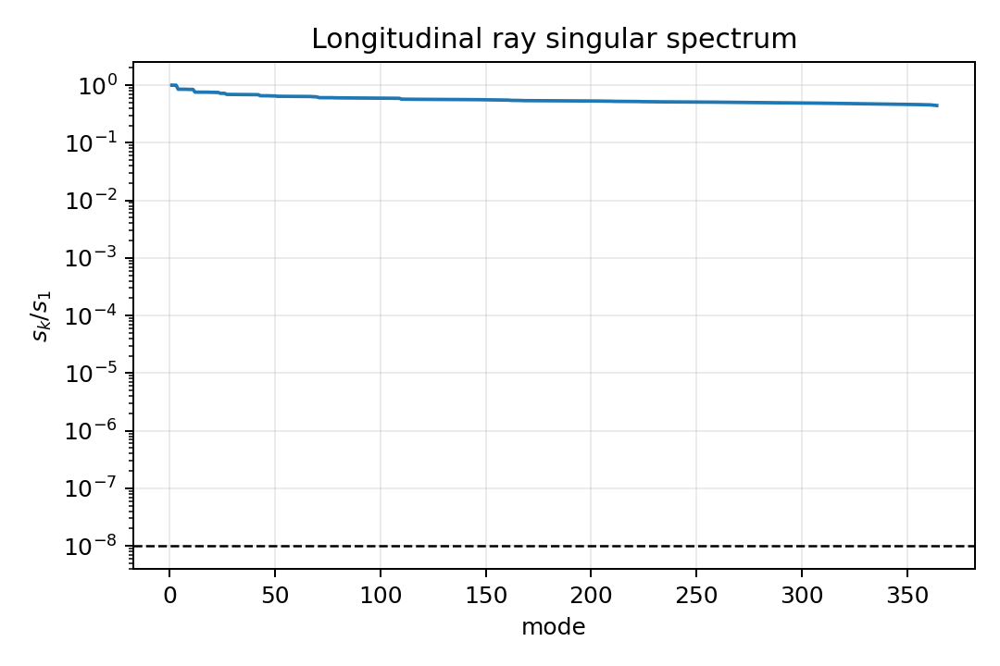
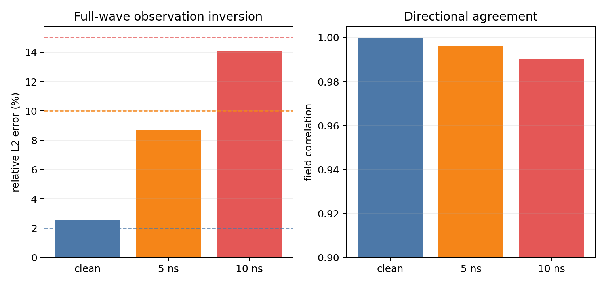
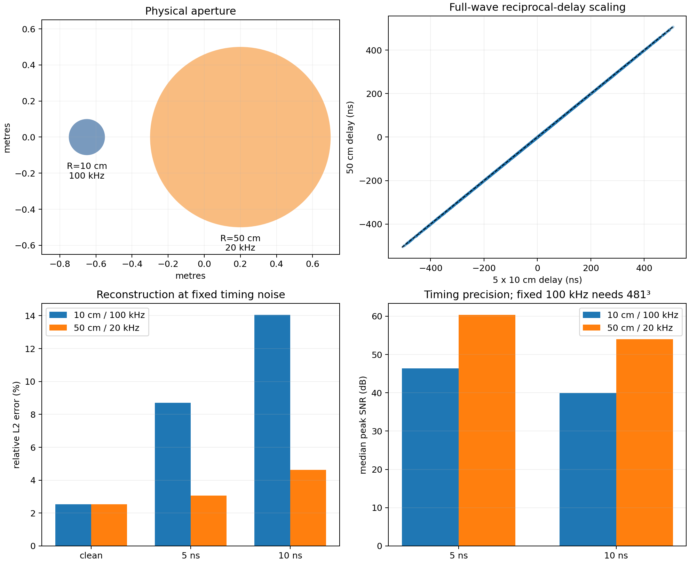

# 三维单位球 Water-USCT 全波观测与走时层析示例

本示例研究如何利用球面超声阵列测量流动引起的双向传播时间差，并重建单位球内的三维无散
速度场。正式观测由开放水域全波模拟产生；随后从压力波形中提取 reciprocal travel-time
difference，最后使用满足不可压缩和球壁零速度约束的有限维基函数进行 TSVD 走时层析反演。

> 当前默认配置中的 `R=0.10 m` 是**球半径 10 cm**，对应直径 20 cm；缩放实验的
> `R=0.50 m` 是**球半径 50 cm**，对应直径 1 m。

## 1. 示例概览

完整数据链路为：

```text
解析三维无散流场
        │
        ├── 零流全波模拟 ──> p0(a -> b, t)
        │
        └── 有流全波模拟 ──> pU(a -> b, t)
                                  │
                         直达波局部波形配准
                                  │
                    双向到时差 ΔTab = δtab - δtba
                                  │
                      纵向直射线矩阵 + TSVD
                                  │
                       三维无散速度场重建
```

本示例属于 **全波生成观测 + 走时层析反演**，不是全波形反演（FWI）。全波模拟负责生成压力
时间序列，反演算子仍是一阶小 Mach 数纵向直射线模型，而不是全波 Jacobian。

## 2. 物理模型与真值流场

单位球坐标为

$$
B=\{\boldsymbol\xi\in\mathbb R^3:\lVert\boldsymbol\xi\rVert<1\},
\qquad \mathbf x=R\boldsymbol\xi.
$$

水体参数和流速尺度为：

| 参数 | 数值 |
|---|---:|
| 声速 $c_0$ | 1480 m/s |
| 密度 $\rho_0$ | 998 kg/m³ |
| 最大流速 | 1 m/s |
| 最大 Mach 数 | $6.76\times10^{-4}$ |

真值采用倾斜轴平滑旋涡：

$$
\mathbf U(\boldsymbol\xi)
=\frac{3\sqrt3}{2}(1-\lVert\boldsymbol\xi\rVert^2)
  (\boldsymbol\omega\times\boldsymbol\xi),
\qquad
\boldsymbol\omega=\frac{(1,2,3)}{\sqrt{14}}.
$$

该流场三个速度分量均非零，解析上严格无散，在球壁速度为零，且最大速度恰为 1 m/s。

**下图为规定射线参考观测的切片，不是第 7 节全波观测的重建。**



## 3. 球面采集系统

球面上放置 96 个确定性 Fibonacci 阵元，每个阵元均可发射和接收。使用所有无重复阵元对：

$$
\binom{96}{2}=4560
$$

个 reciprocal pairs，即 9120 条有向传播路径。阵元位置不根据真值流场调优。



此外固定评估 32、48、64、96 阵元的几何覆盖与射线矩阵稳定性，但只有 96 阵元配置作为正式
验收配置。

## 4. 全波观测如何生成

### 4.1 对流声波求解

全波模块在开放水域笛卡尔网格上求解一阶小 Mach 数对流声学模型，其主体可写为

$$
\partial_{tt}p+2\mathbf U\cdot\nabla(\partial_t p)-c_0^2\nabla^2p=s.
$$

外层采用分裂场 PML 吸收出射波。每个阵元依次作为发射源，所有阵元同时作为接收器，得到完整
的 source-receiver-time 压力张量。正式生产同时计算 73³ 粗网格和 97³ 细网格，用二者差异估计
数值离散误差；正式观测使用 97³ 结果。

每个网格分别运行：

- 零流场全波模拟：产生基准波形 $p_0^{a\to b}(t)$；
- 有流场全波模拟：产生观测波形 $p_U^{a\to b}(t)$。

射线公式不参与全波压力数据的生成或校正，仅用于事后诊断全波提取的到时差。

### 4.2 从压力波形提取到时

在几何直达波预计到达时刻附近，用零流波形及其时间导数拟合有流波形：

$$
p_U(t)\approx\alpha p_0(t)+\beta\,\partial_t p_0(t)+b,
\qquad
\delta t=-\frac{\beta}{\alpha}.
$$

该局部线性配准同时允许振幅变化和直流偏移，得到亚时间步的有向时间移动。对阵元对
$(a,b)$，最终观测为

$$
\Delta T_{ab}=\delta t_{a\to b}-\delta t_{b\to a}.
$$



### 4.3 噪声数据

`noise_5ns` 和 `noise_10ns` 不是直接向走时数组添加噪声，而是分别向零流和有流压力波形加入
独立 Gaussian 白噪声，然后重新执行完整到时提取。程序只根据“加噪前后提取到时之差”标定一个
全局压力噪声幅度，使 reciprocal delay 扰动标准差达到 5 ns 或 10 ns；标定过程不读取真实
速度场、射线参考走时或重建误差。

## 5. 反演基函数

对每个中心 $\mathbf c_j$ 和方向 $\mathbf e_k$，定义原始无散旋度模式

$$
\boldsymbol\psi_{jk}(\boldsymbol\xi)=
\nabla_{\boldsymbol\xi}\times\left[
(1-\lVert\boldsymbol\xi\rVert^2)^2
\exp\!\left(-\frac{\lVert\boldsymbol\xi-\mathbf c_j\rVert^2}{2\sigma^2}\right)
\mathbf e_k\right].
$$

这些模式逐个满足

$$
\nabla\cdot\boldsymbol\psi_{jk}=0,
\qquad
\boldsymbol\psi_{jk}|_{\partial B}=0.
$$

配置在 $[-0.75,0.75]^3$ 的 7³ 候选点中保留 $\lVert\mathbf c_j\rVert\leq0.76$
的 123 个中心，使用 $\sigma=0.34$。123 个中心乘以三个旋度方向得到 369 个原始模式。

程序构造速度 $L^2(B)$ Gram 矩阵，删除相对特征值不超过 $10^{-10}$ 的 gauge/近相关
方向，再做正交归一化，最终得到 364 个速度空间基函数：

$$
\mathbf U(\boldsymbol\xi)=\sum_{n=1}^{364}a_n\boldsymbol\phi_n(\boldsymbol\xi).
$$

详细推导见 [`basis_and_spectrum.md`](basis_and_spectrum.md)。

## 6. 纵向射线反演与奇异谱

一阶小 Mach 数 reciprocal delay 模型为

$$
\Delta T_i\simeq-\frac{2R}{c_0^2}
\int_{\mathrm{chord}_i}\mathbf U(\boldsymbol\xi)\cdot\mathbf t_i\,d\ell.
$$

代入 364 个基函数后得到

$$
\mathbf d=A\mathbf a+\boldsymbol\varepsilon,
\qquad A\in\mathbb R^{4560\times364}.
$$

射线矩阵采用独立的 32 点 Gauss--Legendre 弦积分，并进行
$A=U\operatorname{diag}(s_k)V^\mathsf T$ 分解。



当前最小归一化奇异值为 0.443655，条件数为 2.254003。在当前 364 维速度空间和 96 阵元
全配对采集下，所有模式都远高于 clean 截断线 $10^{-8}$，不存在明显的离散弱可观测方向。
这不代表连续无限维逆问题本身良定，也不保证比当前基函数更细的结构能够稳定恢复。

无噪声时保留所有高于 $10^{-8}$ 的模态；有噪声时使用 Morozov discrepancy principle
选择 TSVD 阶数，使数据残差接近给定的 reciprocal-delay 噪声标准差。

## 7. 10 cm 半径、100 kHz 正式结果

配置文件：[`examples/02_ball_10cm/config.yaml`](../examples/02_ball_10cm/config.yaml)。

主要物理与数值参数为：

| 参数 | 数值 |
|---|---:|
| 半径 / 直径 | 0.10 m / 0.20 m |
| 中心频率 | 100 kHz |
| 水中波长 | 14.8 mm |
| 球直径包含波长数 | 13.51 |
| 全波生产网格 | 73³、97³ |
| 全波时间步 | 0.40 µs |
| 记录长度 | 180 µs |

97³ 全波提取走时与规定射线参考的 RMSE 为 0.777 ns，相关系数为 0.999881；73³ 与 97³
结果差异的 RMS 为 0.423 ns。正式反演结果为：

| 数据 | 实现走时噪声 | TSVD 阶数 | 相对 $L^2$ 误差 | 场相关系数 | 门禁 |
|---|---:|---:|---:|---:|---|
| clean | 0 ns | 364 | 2.535% | 0.999709 | **未通过**，要求 ≤2% |
| noise 5 ns | 4.996 ns | 231 | 8.700% | 0.996238 | 通过 |
| noise 10 ns | 9.999 ns | 201 | 14.043% | 0.990152 | 通过 |

因此全波采集与到时提取门禁通过，两个噪声反演门禁也通过；但 clean 误差比冻结的 2% 上限高
约 0.535 个百分点，所以完整 `benchmark` 按 fail-closed 规则返回失败状态和退出码 2。



## 8. 50 cm 半径相似缩放实验

配置文件：[`examples/03_ball_50cm/config.yaml`](../examples/03_ball_50cm/config.yaml)。

为了保持声学相似性，将所有物理长度和时间尺度放大 5 倍，同时将频率从 100 kHz 降为
20 kHz。这样保持球直径均为 13.51 个波长，并保持网格点数、每波长网格点数和 CFL 不变。

| 配置 | clean L2 | 5 ns L2 | 10 ns L2 |
|---|---:|---:|---:|
| 半径 10 cm / 100 kHz | 2.535% | 8.700% | 14.043% |
| 半径 50 cm / 20 kHz | 2.535% | **3.067%** | **4.618%** |

流致到时差信号随半径近似放大 5 倍，而绝对计时噪声仍固定为 5 ns 和 10 ns，因此 50 cm
配置的抗噪反演明显改善。clean 归一化误差基本不变，说明该误差主要来自全波观测与一阶射线
反演模型之间的失配，而不是绝对计时噪声。

维持 50 cm 半径但仍使用 100 kHz 将不再是上述相似缩放。估算需要约 481³ 网格，仅保存所有
源的分裂场状态就至少需要约 358 GiB，计算工作量约为 10 cm 情况的 625 倍，因此未实际运行。



缩放对照入口见 [例 04](../examples/04_scale_comparison/README.md)。

## 9. 如何运行

### 9.1 安装与测试

```bash
python -m pip install -e '.[test]'
pytest -q
```

迁移后统一测试集包含方管、球内与尾流，共 58 项。

### 9.2 运行 10 cm 正式基准

```bash
python -m water_usct_3d.sphere.cli benchmark \
  --config examples/02_ball_10cm/config.yaml
```

该命令先运行规定射线参考流程，再生成全波观测、提取到时并进行正式反演。由于当前 clean
L2 门禁未通过，命令预期返回退出码 2，但所有中间产物都会保留。

如 `outputs/fullwave/` 已存在与配置匹配的波形，可避免重新传播；初次使用可先将本例 `results/` 复制为 `outputs/`：

```bash
python -m water_usct_3d.sphere.cli benchmark --reuse-waveforms \
  --config examples/02_ball_10cm/config.yaml
```

只运行全波观测阶段：

```bash
python -m water_usct_3d.sphere.cli fullwave \
  --config examples/02_ball_10cm/config.yaml
```

配置默认请求 CUDA；若没有可用 CUDA，程序会明确失败，不会静默切换到 CPU。

### 9.3 运行 50 cm 缩放实验

```bash
python -m water_usct_3d.sphere.cli fullwave \
  --config examples/03_ball_50cm/config.yaml

python -m water_usct_3d.sphere.scale_study
```

## 10. 关键输出文件

10 cm 结果位于 `../examples/02_ball_10cm/results/`：

| 文件 | 内容 |
|---|---|
| `benchmark_summary.json`（重跑 benchmark 后生成） | 正式 benchmark 状态、各数据集和门禁 |
| `fullwave/observations.h5` | 73³/97³ 零流与有流压力波形及提取到时 |
| `fullwave/noisy_observations.h5` | 波形级 5 ns/10 ns 噪声数据 |
| `fullwave/metrics.json` | 全波网格收敛、射线诊断和反演结果 |
| `fullwave/delays.npz` | 射线参考、粗细网格到时和反演预测 |
| `operator.npz` | 基函数变换、射线矩阵和奇异值 |
| `velocity_fields.npz` | 真值和重建速度场 |
| `singular_spectrum.png` | 纵向射线矩阵奇异谱 |
| `velocity_slices.png` | 三个正交速度切片 |

50 cm 全波结果位于 `../examples/03_ball_50cm/results/`，缩放汇总位于
`../examples/04_scale_comparison/results/`。

## 11. 当前结论与适用边界

本示例已经验证：

- 可以从三维全波压力波形中稳定提取亚时间步 reciprocal delay；
- 96 阵元全配对对当前 364 维无散速度空间具有良好离散条件数；
- 波形级噪声下，Morozov TSVD 能使残差匹配目标噪声；
- 在固定绝对计时精度下，增大测量尺度会增大流致走时差信号并提高抗噪性。

当前版本不包含：

- 球壁声学耦合、有限孔径换能器和真实换能器方向图；
- 非均匀背景声速、声学衰减和色散；
- 声线弯曲或全波 Jacobian；
- Navier--Stokes CFD、湍流和实验硬件模型；
- 全波形反演或伴随状态优化。

因此，当前结果应解释为受控的合成三维走时层析基准，而不是对真实 Water-USCT 设备性能的
直接保证。

