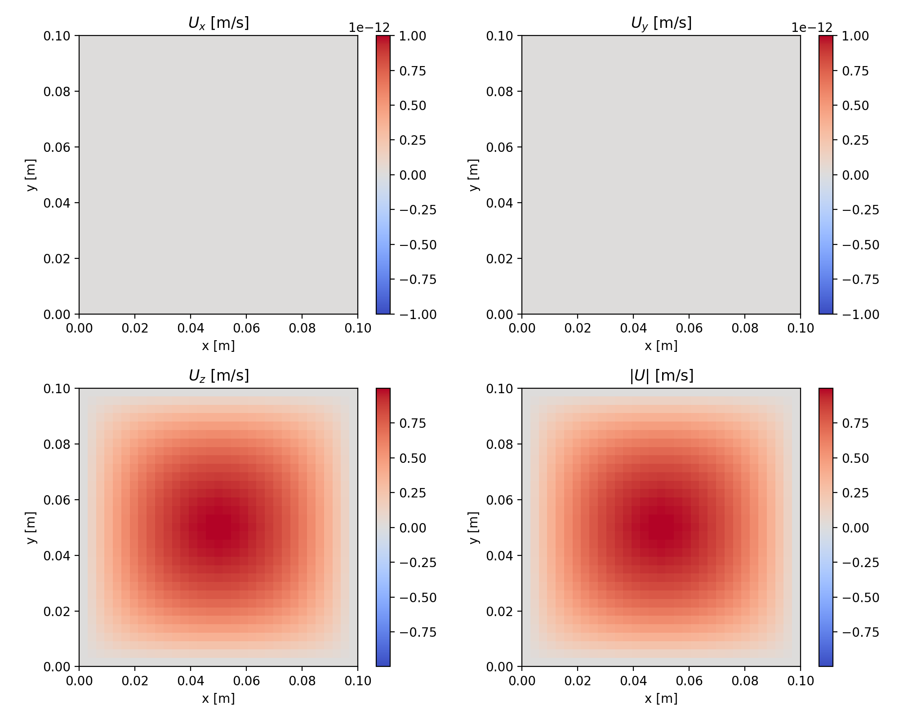
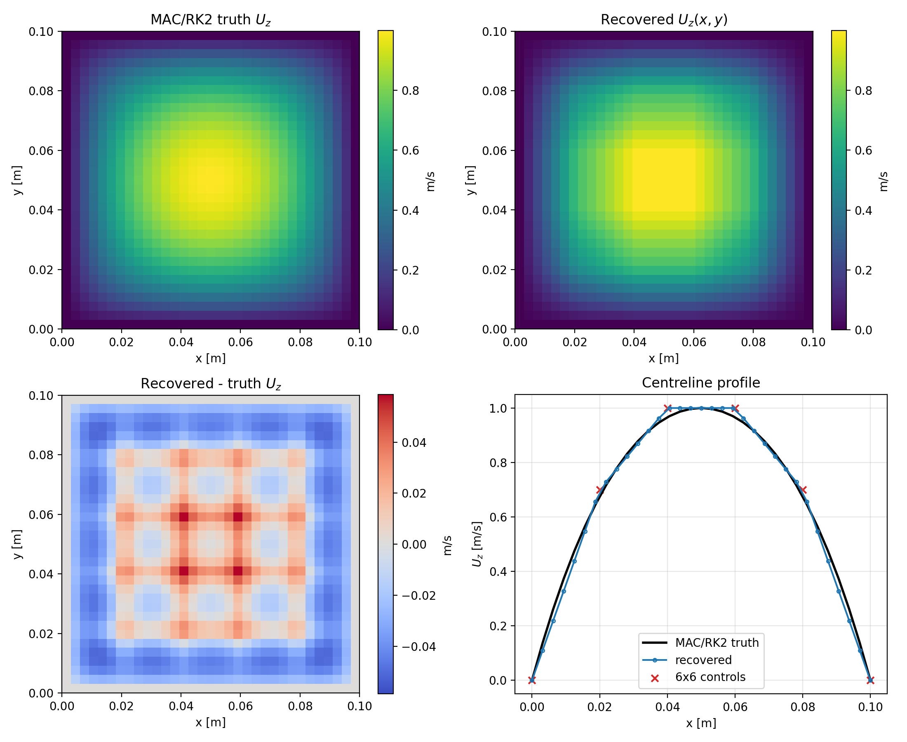
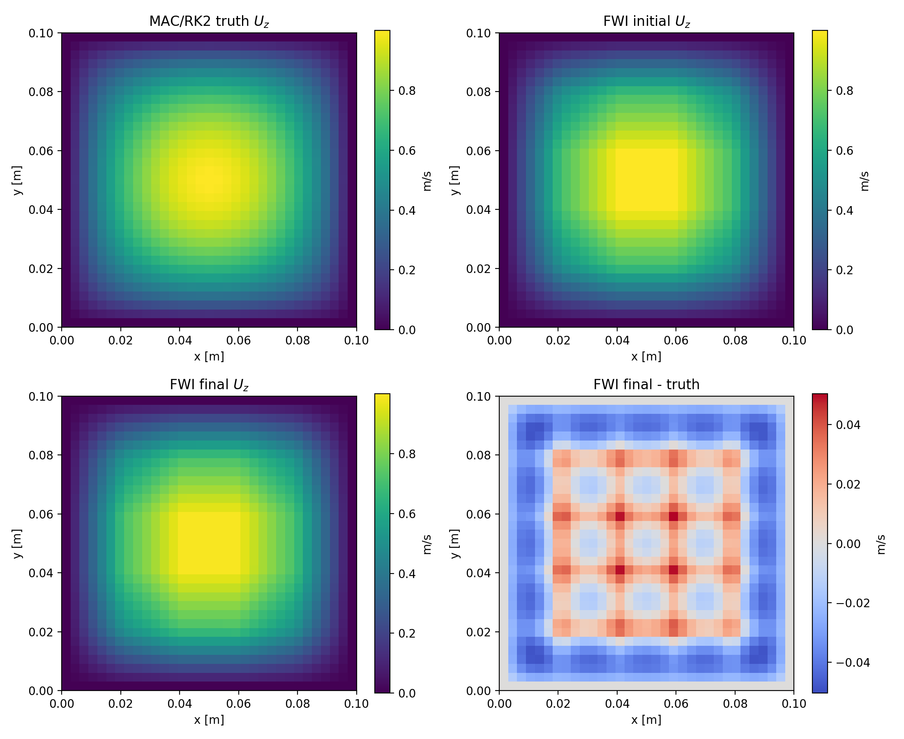

# 例 01：方管轴向流，50 kHz

## 问题定义

水道区域为

```text
(x, y, z) in [0, 0.10] x [0, 0.10] x [0, 0.20] m
```

其中 `z` 是主流方向。水参数和数值参数为：

| 项目 | 数值 |
|---|---:|
| 密度 `rho0` | 998 kg/m^3 |
| 声速 `c0` | 1480 m/s |
| 最大轴向速度 | 1 m/s |
| 有效 Reynolds 数 | 100 |
| 声源中心频率 | 50 kHz |
| 生产声学网格 | 33 x 33 x 65 |
| 生产网格间距 | 3.125 mm |
| 生产时间步 | 0.30 us |
| 记录长度 | 240 us，800 步 |
| 独立细网格 | 41 x 41 x 81 |
| 细网格时间步 | 0.24 us |
| 随机种子 | 20260807 |

流体真值不是手工画出的速度场。`simulate_flow` 使用 MAC 交错网格、RK2 预测、
压力 Poisson 投影和无滑移侧壁，恢复方形管 Poiseuille 流。解析 Fourier 级数和
三分量制造解只用于验证求解器。

声学求解器计算四状态线性化 Euler 系统：

```text
dp/dt + U dot grad(p) + c0 div(w) = source
dw/dt + (U dot grad)w + (grad U)w + c0 grad(p) = 0
```

它使用八阶交错空间差分和 RK4 时间推进，保留背景速度梯度的全部九项。`x/y` 为
刚性奇偶延拓边界，`z` 两端使用 pressure-only sponge，末端仍由刚性 parity plane
闭合。声源和接收器是互为离散伴随的理想点换能器，而不是有限孔径活塞模型。

## 阵列与数据

阵列包含 3 个环、每环 8 个换能器，共 24 个阵元：

- 环位置：`z = 0.0375, 0.10, 0.1625 m`；
- 每次单独发射一个阵元，另外 23 个接收；
- 共 552 条有序波形和 276 个互易对；
- 所有阵元同时落在 33 和 41 网格的公共物理节点上；
- 阵元距侧壁 12.5 mm，位于 z-sponge 之外。

数据集合同如下：

| 数据集 | 生成方式 | 用途 |
|---|---|---|
| `matched_clean` | 33x33x65 网格、同一求解器 | 方法开发和正则选择 |
| `fine_clean` | 独立 41x41x81 网格 | 冻结跨网格验证 |
| `fine_noisy` | `fine_clean` 每道精确加入 1% RMS Gaussian 噪声 | 冻结噪声验证 |

禁止使用 `fine_noisy` 选择频段、正则化或迭代次数。

## 安装

推荐 Python 3.10 或更高版本。CPU 可以运行测试、几何和部分验证；正式 24 炮声学
生成与 FWI 建议使用 CUDA GPU。

```bash
cd Flow_estimation_official
python -m pip install -e '.[test]'
pytest -q
```

测试从仓库根目录运行；本次迁移后统一测试集有 58 项。

## 最快检查

先检查帮助、测试和阵列几何：

```bash
python -m water_usct_3d.cli --help
pytest -q
python -m water_usct_3d.cli geometry \
  --config examples/01_square_duct/config.yaml
```

几何命令约需几十秒。当前参考结果为中央区域 `rank=3`、归一化最小特征值
`0.01412`、最大条件数 `34.90`，通过三维覆盖门禁。

快速声学代码路径检查：

```bash
python -m water_usct_3d.cli verify-acoustic \
  --config examples/01_square_duct/config.yaml --smoke
```

`--smoke` 只验证代码路径，不能代替正式数值门禁。

## 完整复现顺序

严格按照下面顺序运行；某一级失败时应停止下游正式实验。

### 6.1 流体与几何

```bash
python -m water_usct_3d.cli verify-flow \
  --config examples/01_square_duct/config.yaml
python -m water_usct_3d.cli geometry \
  --config examples/01_square_duct/config.yaml
```

`verify-flow` 同时运行方形管解析对照、MAC 投影约束和三分量制造解收敛测试，并输出
HDF5、PNG、PDF 和 JSON。

### 6.2 声学门禁

```bash
python -m water_usct_3d.cli verify-acoustic \
  --config examples/01_square_duct/config.yaml
```

它验证八阶导数、零流相速度、均匀流 Doppler 符号、剪切项、静水互易性、刚性域
能量、33/41 网格一致性和离散梯度 Taylor 测试。

### 6.3 生成三套数据

```bash
python -m water_usct_3d.cli generate \
  --config examples/01_square_duct/config.yaml --case matched_clean
python -m water_usct_3d.cli generate \
  --config examples/01_square_duct/config.yaml --case fine_clean
python -m water_usct_3d.cli generate \
  --config examples/01_square_duct/config.yaml --case fine_noisy
```

### 6.4 分级反演

单参数幅值：

```bash
for beta in 0 0.8 1.2; do
  python -m water_usct_3d.cli invert \
    --config examples/01_square_duct/config.yaml \
    --stage amplitude --initial-beta "$beta" --production
done
```

轴向剖面：

```bash
python -m water_usct_3d.cli invert \
  --config examples/01_square_duct/config.yaml --stage profile --production
```

准备四种 FWI 初值并运行开发迭代：

```bash
python -m water_usct_3d.cli fwi-profile \
  --config examples/01_square_duct/config.yaml --prepare-only
python -m water_usct_3d.cli fwi-profile \
  --config examples/01_square_duct/config.yaml \
  --initialization travel_time --iterations-per-band 1
```

冻结跨网格验证：

```bash
python -m water_usct_3d.cli validate-profile \
  --config examples/01_square_duct/config.yaml --case fine_clean
python -m water_usct_3d.cli validate-profile \
  --config examples/01_square_duct/config.yaml --case fine_noisy
```

通用三分量矢量势入口仍保留：

```bash
python -m water_usct_3d.cli invert \
  --config examples/01_square_duct/config.yaml --stage full --production
```

但当前参考结果主要验证轴向方形管流；不要把它解释成复杂一般三分量流的充分证据。

## 已验证参考结果

| 门禁/任务 | 结果 | 状态 |
|---|---:|---|
| 方形管流相对 L2 | `2.33e-4` | PASS |
| float32 相对散度 | `4.42e-6` | PASS |
| 制造解收敛阶 | `1.942` | PASS |
| 八阶导数实测阶 | `7.979` | PASS |
| 静水互易误差 | `9.74e-16` | PASS |
| 刚性无源能量漂移 | `9.98e-6` | PASS |
| 33/41 有效接收道失配 | `2.096%` | PASS |
| 声学 Taylor 斜率 | `1.997` | PASS |
| 幅值反演 beta | `0.999842` | PASS |
| 幅值相对误差 | `0.00557%` | PASS |
| 轴向剖面相对 L2 | `4.814%` | PASS |
| 轴向剖面相关系数 | `0.998841` | PASS |
| 4 频段开发 FWI 最终误差 | `4.473%` | PASS（开发协议） |
| FWI 的 65 kHz loss 降幅 | `7.999%` | PASS（开发协议） |

**结果解释：** `profile/start_0p0/metrics.json` 的 `selected_candidate` 为 `amplitude_prior`。
4.814% 是在幅值先验与走时更新两种候选间按波形失配选出的结果，不是无先验纯走时重建。

FWI 参考运行每频段只接受一次 Armijo 更新；它不是原计划中每频段 15 次迭代的正式
性能声明。原 strong-Wolfe 候选在 15 分钟内没有接受第一步，因此被保留为失败记录。

## 如何理解已有图片

`results/flow/` 中有三类容易混淆的图：

- `duct_velocity_components.*`：方形管主实验中求解器实际得到的速度场；
- `manufactured_components.*` 和 `manufactured_vectors_streamlines.*`：制造解的参考场，
  用于检查三分量、对流项和投影，不是主实验真值；
- `manufactured_reference_solver_error.*`：明确并排显示制造参考、MAC/RK2 数值结果和
  二者误差，是判断“求解器是否真的恢复制造场”的正确图。

主实验关心的是 `Uz(x,y)`；理想充分发展方形管流中 `Ux=Uy=0`。制造解中的横向旋涡
是验证工具，不能当作由恒定轴向体力自然产生的流动。

## 参考产物

关键入口：

- `results/verification/flow_metrics.json`
- `results/verification/acoustic_metrics.json`
- `results/flow/flow_fields.h5`
- `results/matched_clean/data.h5`
- `results/inversion/amplitude/summary_metrics.json`
- `results/inversion/profile/start_0p0/metrics.json`
- `results/inversion/profile_fwi/metrics.json`

每次 CLI 调用将结构化记录写入该配置输出目录的 `run_log.jsonl`。

## 公共 Python API

```python
from water_usct_3d import (
    build_acquisition_3d,
    extract_reciprocal_delays_3d,
    invert_travel_time_3d,
    simulate_acoustic,
    simulate_flow,
    vector_potential_to_velocity,
    waveform_objective_3d,
)
```

数组约定：速度一般使用 `(3, nx, ny, nz)`；声压波形返回
`(source, receiver, time)`；长度单位为 m，时间为 s，速度为 m/s。

## 已知限制

- 1 m/s、有效 Re=100 是低马赫算法基准，不宣称是真实水中 1 m/s 的层流实验。
- 点换能器没有机电响应、有限孔径或实验标定。
- 生产与细网格的原始绝对波形差异可能大于流动微扰；跨网格比较必须使用预计算
  静水标定，不能把数值基线误差解释成流速误差。
- `fine_noisy` 是冻结验证集，不允许用于调参。
- 完整 24 炮 FWI 计算量和显存较大；先运行测试、geometry 和 acoustic smoke。
- 本 benchmark 不包含圆柱尾流，也不支持相关 wake CLI。


## 成像结果与目录

所有命令从仓库根目录执行。`config.yaml` 写入本例的 `outputs/`，`results/` 为历史参考；
`reference_config.yaml` 仅用于读取参考数据，执行写入型 CLI 会覆盖参考结果。







剖面参数是 6×6 双线性控制网格，边界控制点固定为零，只有 4×4=16 个自由参数；
沿 z 不变，Ux=Uy=0。本例中的三分量制造解仅用于验证求解器。
