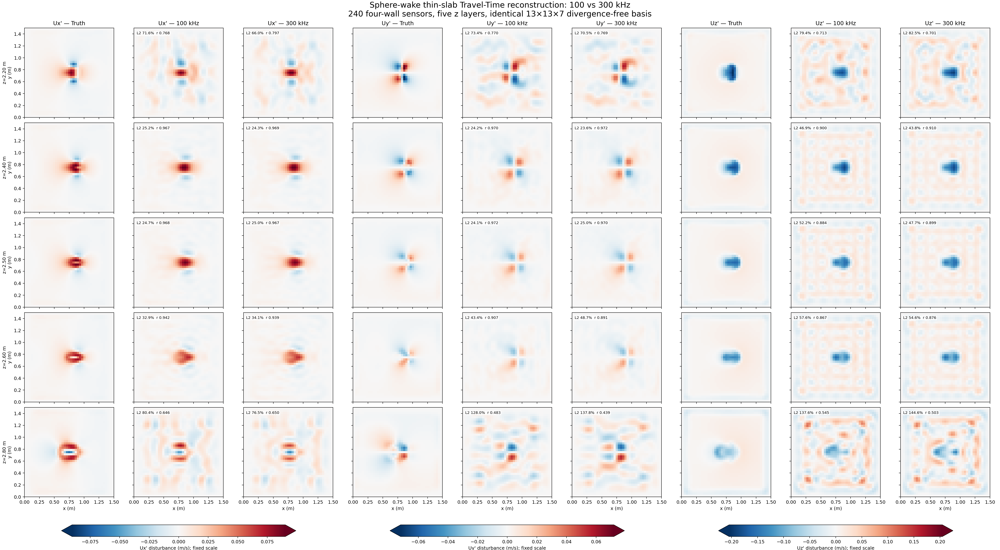

# 例 06：4 m Python/MAC 尾流频率消融

这一表来自较早的 Python/MAC `1.5 x 1.5 x 4.0 m` 薄层真值，不是上述 8 m incflo
19 截面主实验，绝对误差不能横向比较。其作用是隔离频率趋势：固定 5 层 x 48 阵元
（240 总阵元）、21,600 射线和 3,549 模态。

| 频率 | 波长 | Fresnel 宽度代理 | Joint L2 | Ux/Uy/Uz L2 | Ux/Uy/Uz corr |
|---:|---:|---:|---:|---:|---:|
| 100 kHz | 14.80 mm | 74.43 mm | 48.46% | 29.05 / 33.85 / 52.84% | 0.955 / 0.943 / 0.881 |
| 150 kHz | 9.87 mm | 60.77 mm | 46.11% | 27.85 / 30.73 / 50.31% | 0.959 / 0.953 / 0.890 |
| 300 kHz | 4.93 mm | 42.97 mm | **44.49%** | 27.92 / 30.95 / **48.36%** | 0.959 / 0.953 / 0.896 |

100→300 kHz 只改善 3.97 个 joint 百分点，主要改善 Uz；100--150 kHz 后 Ux/Uy 基本
平台化。Fresnel 宽度只是比较代理，不是实测 PSF FWHM。



## 具体设置与复现

ROI z=2.1–2.9 m，5 个阵列层 z=[2.2,2.35,2.5,2.65,2.8] m；
13×13×7 个中心、3 个旋度方向，σxy=0.11 m、σz=0.13 m；
20 点轴向积分，41×41×9 评价网格，8 次噪声重复，种子 20260807。
快照时刻 31.203 s；基线是 8.004–9.604 s 五帧平均，完整协议保存在各个 `report_*khz.json` 的 `contract` 中。
快照和基线已收纳到本例 `data/`，不依赖旧路径。

```bash
python examples/06_frequency_ablation/run.py
```

此命令从报告读取 100/150/300 kHz 各自的冻结设置，输出至本例 `outputs/`。
数值依据：[100 kHz](results/metrics/aux_frequency/report_100khz.json)、
[150 kHz](results/metrics/aux_frequency/report_150khz.json)、
[300 kHz](results/metrics/aux_frequency/report_300khz.json)。

