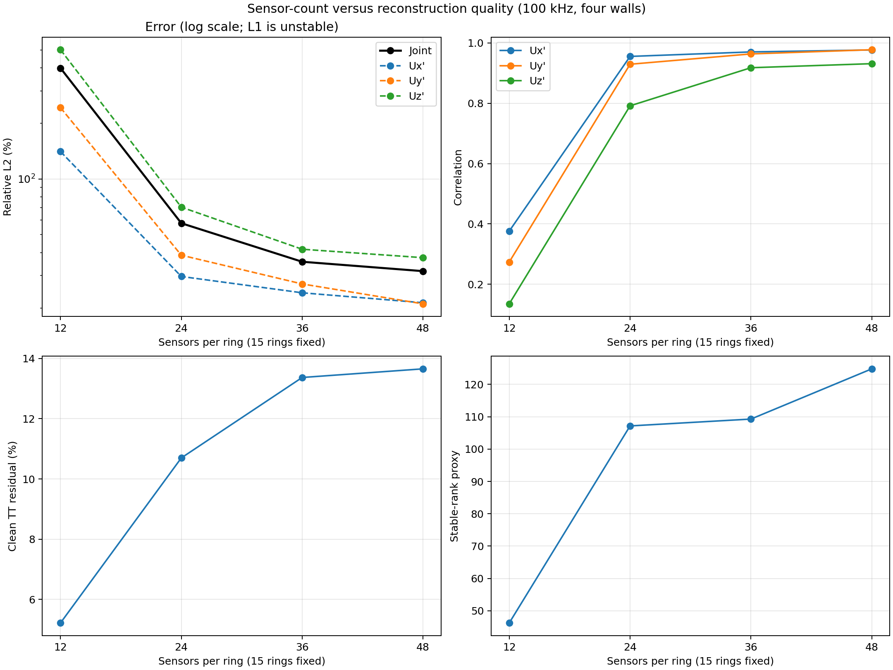

# 例 07：8 m Python/MAC 全 slab 阵元消融

另一个较早的 Python/MAC 8 m pilot 使用固定 15 圈、100 kHz、8,619 模态和全 slab
all-pairs。它与局部窗口主表的 ROI、pair budget 和真值不同，仅用于验证阵元数量趋势。

| 每圈阵元 | 总阵元 | pair 数 | Joint L2 | Ux/Uy/Uz L2 | Ux/Uy/Uz corr |
|---:|---:|---:|---:|---:|---:|
| 12 | 180 | 12,150 | 398.63% | 140.85 / 243.46 / 501.11% | 0.376 / 0.274 / 0.135 |
| 24 | 360 | 48,600 | 57.63% | 29.67 / 38.68 / 70.40% | 0.955 / 0.929 / 0.792 |
| 36 | 540 | 109,350 | 35.65% | 24.21 / 27.04 / 41.67% | 0.970 / 0.964 / 0.918 |
| 48 | 720 | 194,400 | **31.71%** | **21.39 / 21.10 / 37.51%** | **0.977 / 0.978 / 0.931** |




## 具体设置与数据可用性

15 圈均匀分布于 z=3–5 m，主评价 ROI 为 z=3.5–4.5 m；频率 100 kHz，
13×13×17×3=8619 模态，σxy=0.11 m、σz=0.13 m，
51×51×25 评价网格，12 点积分，4 次噪声重复，种子 20260807。
该大矩阵版本使用保留的观测行选择 ridge、共轭梯度求解，不采用局部窗口版本的谱 GCV。

本例保留图表、完整 [report.json](results/metrics/aux_sensor_count/report.json)、
[metrics.csv](results/metrics/aux_sensor_count/metrics.csv) 与可执行代码。
原实验依赖远程 `pilot_truth_8m/frozen_long_snapshot.h5` 和 `matched_long_baseline.h5`，
快照时刻 50.404 s，frame_index=63；这两份准确的 pilot 文件未在当前本地原目录找到，
因此未用名称相似的 smoke 数据替代。重算需要先提供原始文件：

```bash
python -m long_domain_multislice_tt_study.run_sensor_count_sweep \
  --snapshot /path/to/pilot_truth_8m/frozen_long_snapshot.h5 \
  --baseline /path/to/pilot_truth_8m/matched_long_baseline.h5 \
  --output examples/07_sensor_count_ablation/outputs --device cuda
```

这是当前唯一缺少完整原始输入的辅助例子；已有图表可直接查看。
